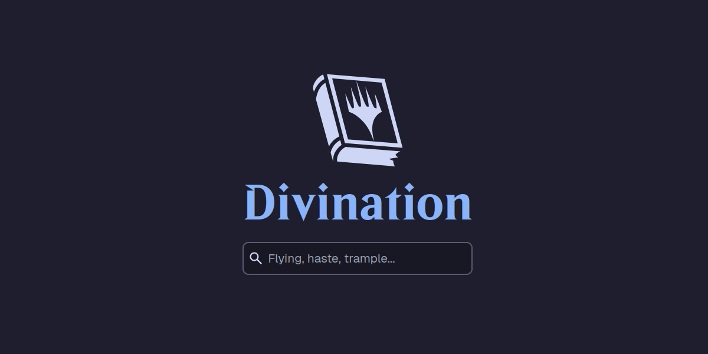

  

# Overview

_**Divination**_ is your home for Magic: The Gathering rules. The Comprehensive Rules are vast, detailed, and complicated - begging for a simpler, more intuitive interface. That's where Divination comes in.

Whether you're new to the game or have been playing for years, if you need a ruling, this is the place to be.

Start searching today: https://divination.nz

## Features

- Search any of Magic: The Gathering's 2000+ rules
- Consult the official glossary for keywords and definitions
- Browse an improved version of the official Comprehensive Rules

## Legal

Portions of Divination are unofficial Fan Content permitted under the Wizards of the Coast Fan Content Policy. The literal information presented on our sites about Magic: The Gathering is copyright Wizards of the Coast, LLC. Divination is not produced by or endorsed by Wizards of the Coast.

Divination itself, including all code and non-code assets, is licensed under the [GNU AFFERO GENERAL PUBLIC LICENSE Version 3](https://www.gnu.org/licenses/agpl-3.0.en.html).
